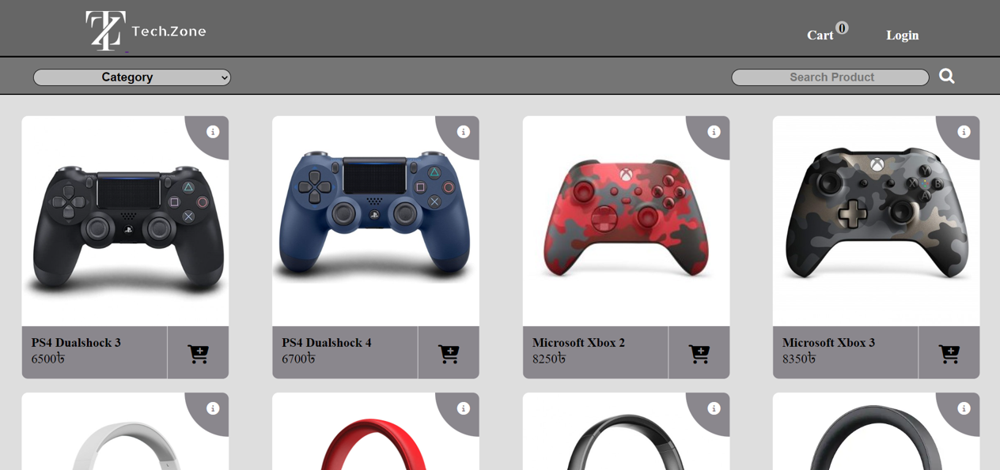
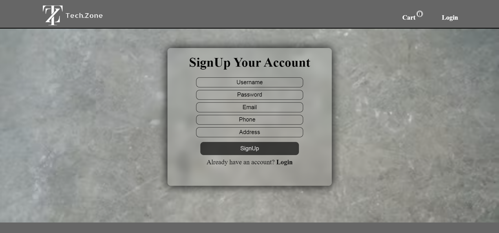
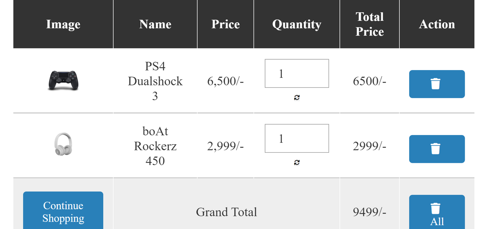
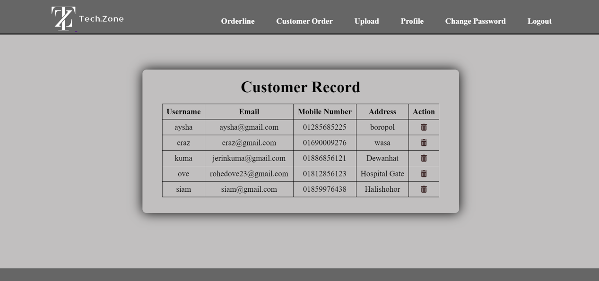

# 🛒 Techzone

Techzone is a simple e-commerce web application built using **PHP** and
**MySQL**.\
It allows users to browse products, register/login, and manage a
shopping cart.\
The project follows a basic modular structure separating customer and
admin functionalities.

------------------------------------------------------------------------

## 📌 Overview

Techzone is designed as a beginner-friendly online shopping platform.\
It demonstrates core web development concepts including:

-   Database connectivity
-   User authentication
-   Session handling
-   Cart management
-   Admin product control

------------------------------------------------------------------------

## 🚀 Features

-   ✅ User Registration & Login
-   ✅ Product Browsing
-   ✅ Add to Cart / Remove from Cart
-   ✅ Session-Based Cart System
-   ✅ Admin Panel (Product Management)
-   ✅ Database-Driven Product Storage

------------------------------------------------------------------------

## 🗂️ Project Structure

    Techzone/
    │
    ├── admin/              # Admin panel files
    ├── customer/           # Customer-facing pages
    ├── pimg/               # Product images
    ├── Screenshots/        # Website screenshots
    ├── Cart.php            # Cart management logic
    ├── connection.php      # Database connection file
    ├── explore.php         # Product listing page
    ├── index.php           # Homepage
    ├── login.php           # Login page
    ├── SignUp.php          # Registration page
    ├── nav.php             # Navigation bar include
    ├── footer.php          # Footer include
    └── README.md           # Project documentation

------------------------------------------------------------------------

## ⚙️ Installation Guide

### 1️⃣ Clone the Repository

``` bash
git clone https://github.com/iftikhoq/Techzone.git
```

### 2️⃣ Setup Database

-   Create a new MySQL database (e.g., `techzone`)
-   Import the provided `.sql` file (if available)
-   Or manually create required tables

### 3️⃣ Configure Database Connection

Open `connection.php` and update:

``` php
$con = mysqli_connect("localhost", "username", "password", "database_name");
```

### 4️⃣ Run the Project

-   Move project folder to:
    -   `htdocs/` (XAMPP)
    -   `www/` (WAMP)
-   Start Apache & MySQL
-   Visit:

```
    http://localhost/Techzone/

---

## 📸 Screenshots

### Homepage


### Signup


### Shopping Cart


### Customer record



------------------------------------------------------------------------
---


## 🛠️ Technologies Used

-   PHP
-   MySQL
-   HTML
-   CSS
-   Session Handling

------------------------------------------------------------------------

## 🎯 Future Improvements

-   🔍 Product search & filtering
-   💳 Payment gateway integration
-   📦 Order history system
-   📱 Responsive UI using Bootstrap or Tailwind
-   🔐 Password hashing for better security

------------------------------------------------------------------------

## 📄 License

This project is open-source and free to use for learning purposes.

------------------------------------------------------------------------

## 👨‍💻 Author

**Iftikhirul Hoque**\
GitHub: https://github.com/iftikhoq
